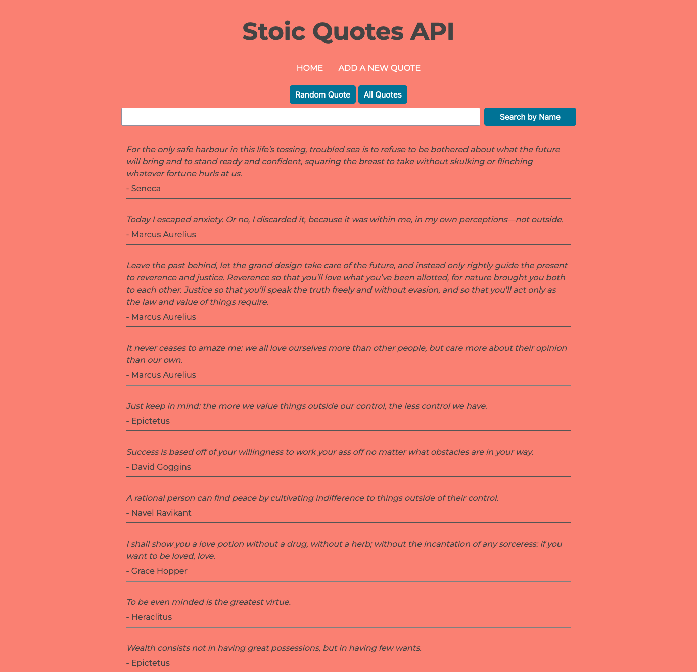

# Stoic Quotes

This project is a simple quote-serving JSON API using Express. Last month, I set out to learn node.js by building a barebones node http server and for this project I decided to use Express to build out web api.

### Screenshot

### Links

- Github repo: [https://github.com/surla/stoic-quotes](https://github.com/surla/stoic-quotes)
- Live Site URL: [https://enthusiastic-jade-bunny.cyclic.app](https://enthusiastic-jade-bunny.cyclic.app)

## Built with

- Javascript
- Node
- Express
- HTML
- CSS

### Install

`npm install`

### Usage

`node server.js`

## Author

Joseph Surla

- Github: @surla
- Twitter: @josephsurla
- Website: https://josephsurla.com

## Acknowledgements

For this project, I want to thank [Kam Lasater](https://github.com/seekayel) for reaching out to me. He informed me about his project [Cyclic.sh](Cyclic.sh) and allowed me to deploy with a few clicks. It is great that developers like Kam can make this complex world of coding easier for someone like me.
